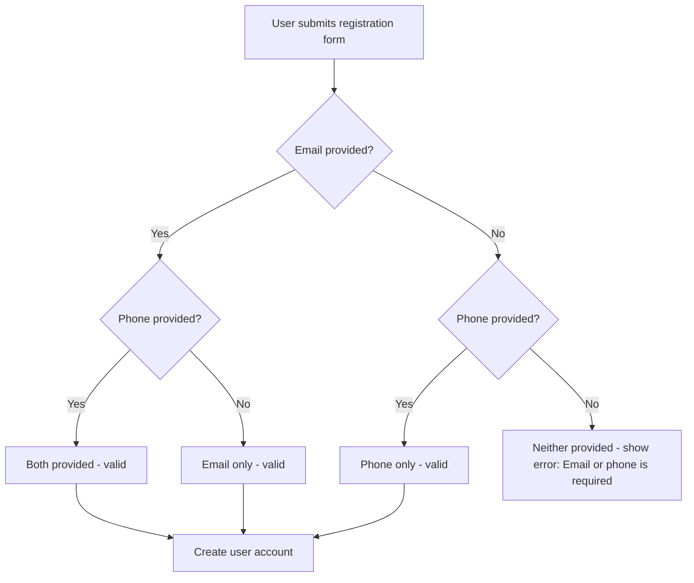

# Fix Email/Phone Registration Validation

## Problem

The registration form validation incorrectly requires **both** email and phone fields as mandatory. When validation fails, the default Laravel error message says "The phone field is required" — which displays for both the email and phone fields, confusing users who have already filled one of them out.

The desired behavior is: **at least one of email or phone must be provided** (not both).

## Current State

### Backend - API Registration
**File:** `app/Http/Controllers/Api/AuthController.php` (lines 16-21)

```php
'email' => 'required|string|email|max:255|unique:users',
'phone' => 'required|string|max:20|unique:users',
```
Both fields are `required` — user must fill both.

### Backend - Web Registration (Fortify)
**File:** `app/Actions/Fortify/CreateNewUser.php` (lines 22-38)

```php
'phone' => ['required', 'string', 'max:20', Rule::unique(User::class)],
'email' => ['nullable', 'string', 'email', 'max:255', 'unique:users,email'],
```
Phone is `required`, email is `nullable` — phone is always mandatory, email is optional. This is closer but still doesn't allow email-only registration.

### Frontend - Web Register Page
**File:** `resources/js/pages/auth/register.tsx`
- Only has a **phone** input field — no email field at all
- Shows `errors.phone` for validation errors

### Frontend - Mobile Register Screen
**File:** `somiti-mobile/src/screens/auth/RegisterScreen.tsx` (line 14)
```typescript
if (!name || !email || !phone || !password) {
    Alert.alert('Error', 'Fill all fields');
```
Client-side validation requires ALL fields.

### Login Flow (Already Correct)
**Files:** `app/Providers/FortifyServiceProvider.php` and `app/Http/Controllers/Api/AuthController.php`
The login flow already uses `required_without` correctly:
```php
'login' => 'required_without:phone|string',
'phone' => 'required_without:login|string',
```

## Solution

Apply the same `required_without` pattern from the login flow to the registration flow, with custom error messages.

### Validation Flow Diagram



## Changes Required

### 1. API AuthController - Register Validation
**File:** `app/Http/Controllers/Api/AuthController.php`

Change validation rules from:
```php
'email' => 'required|string|email|max:255|unique:users',
'phone' => 'required|string|max:20|unique:users',
```
To:
```php
'email' => 'required_without:phone|string|email|max:255|unique:users',
'phone' => 'required_without:email|string|max:20|unique:users',
```

Add custom error messages:
```php
$request->validate([...], [
    'email.required_without' => 'The email or phone field is required.',
    'phone.required_without' => 'The email or phone field is required.',
]);
```

Update user creation to handle nullable fields:
```php
$user = User::create([
    'name' => $request->name,
    'email' => $request->email ?? null,
    'phone' => $request->phone ?? null,
    'password' => Hash::make($request->password),
]);
```

### 2. Fortify CreateNewUser - Web Registration
**File:** `app/Actions/Fortify/CreateNewUser.php`

Change validation rules from:
```php
'phone' => ['required', 'string', 'max:20', Rule::unique(User::class)],
'email' => ['nullable', 'string', 'email', 'max:255', 'unique:users,email'],
```
To:
```php
'phone' => ['required_without:email', 'string', 'max:20', Rule::unique(User::class)],
'email' => ['required_without:phone', 'nullable', 'string', 'email', 'max:255', 'unique:users,email'],
```

Add custom messages via `Validator::make()` 4th argument:
```php
Validator::make($input, [...], [
    'phone.required_without' => 'The email or phone field is required.',
    'email.required_without' => 'The email or phone field is required.',
])->validate();
```

### 3. Web Register Page - Add Email Field
**File:** `resources/js/pages/auth/register.tsx`

- Add an email input field between name and phone fields
- Remove `required` attribute from both email and phone HTML inputs (since at least one is needed, not both)
- Update error display to show a combined error message for email/phone:
  ```tsx
  <InputError message={errors.email || errors.phone} />
  ```
  Place this after the phone field so it appears once, covering both fields.
- Add helper text like "At least one of email or phone is required"

### 4. Mobile Register Screen - Client-Side Validation
**File:** `somiti-mobile/src/screens/auth/RegisterScreen.tsx`

Change client-side validation from:
```typescript
if (!name || !email || !phone || !password) {
    Alert.alert('Error', 'Fill all fields');
```
To:
```typescript
if (!name || (!email && !phone) || !password) {
    Alert.alert('Error', 'Please provide at least an email or phone number, along with your name and password');
```

### 5. Mobile Auth Store - Register Function
**File:** `somiti-mobile/src/store/authStore.ts`

The `register` function signature and API call already send all fields. No change needed to the function itself since the backend now accepts either field as optional. The API call will send whatever values the user provides (empty strings for omitted fields), and the backend validation will handle it correctly.

However, we should ensure empty strings are sent as empty/omitted rather than empty strings that might not trigger `required_without` correctly. Update to filter out empty values:
```typescript
register: async (name, email, phone, password) => {
    const payload: any = {
        name,
        password,
        password_confirmation: password,
    };
    if (email) payload.email = email;
    if (phone) payload.phone = phone;
    const { data } = await client.post('/auth/register', payload);
    ...
},
```

## Files to Modify (Summary)

| File | Change |
|------|--------|
| `app/Http/Controllers/Api/AuthController.php` | Change `required` to `required_without` for email/phone, add custom messages, handle nullable in create |
| `app/Actions/Fortify/CreateNewUser.php` | Change `required` to `required_without` for phone, add `required_without:phone` to email, add custom messages |
| `resources/js/pages/auth/register.tsx` | Add email input field, remove `required` from phone, show combined error message |
| `somiti-mobile/src/screens/auth/RegisterScreen.tsx` | Update client-side validation to require at least one of email/phone |
| `somiti-mobile/src/store/authStore.ts` | Filter out empty email/phone from API payload |